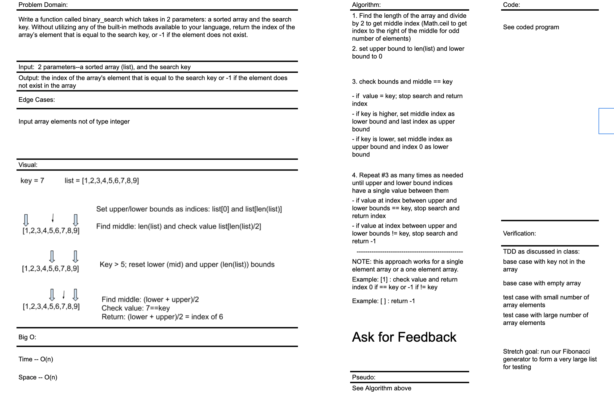

# Binary Search of an Array
This is code challenge 03 of 401-Python (seattle-py-401n2)

Developers: Kim Damalas 

Date: 14 December 2020
____________________
## Challenge

Write a function called `BinarySearch` which takes in 2 parameters: a sorted array and the search key. Without utilizing any of the built-in methods available to your language, return the index of the array’s element that is equal to the search key, or -1 if the element does not exist.
__________

## Approach & Efficiency

Space = O(n)
Time = O(n)

___________

## Solution
See this [Wikipedia link](https://en.wikipedia.org/wiki/Binary_search_algorithm) on binary search

### Algorithm

1. Find the length of the array and divide by 2 to get middle index (Math.ceil to get index to the right of the middle for odd number of elements)
2. set upper bound to len(list) and lower bound to 0

3. Check bounds and middle == key
- if  value = key; stop search and return index
- if key is higher, set middle index as lower bound and last index as upper bound
- if key is lower, set middle index as upper bound and index 0 as lower bound

4. Repeat #3 as many times as needed until upper and lower bound indices have a single value between them
- if value at index between upper and lower bounds == key, stop search and return index
- if value at index between upper and lower bounds != key, stop search and return -1
--------------------------------------------------
NOTE: this approach works for a single element array or a one element array.
Example: [1] : check value and return index 0 if == key or -1 if != key
Example: [ ] : return -1------------------------------
NOTE: this approach works for a single element array or a one element array.
Example: [1] : check value and return index 0 if == key or -1 if != key
Example: [ ] : return -1
_____________
## Testing

We used unit tests as discussed in class to iterate our software build in small steps.  The tests are found in the [Test Code File](./test_array_binary_search.py)

- base case with key not in the array
- base case with empty array
- test case with small number of array elements
- test case with large number of array elements
_______________

## Contributing

Partner: Mason Fryberger collab on whiteboarding session

Our whiteboarding session:

