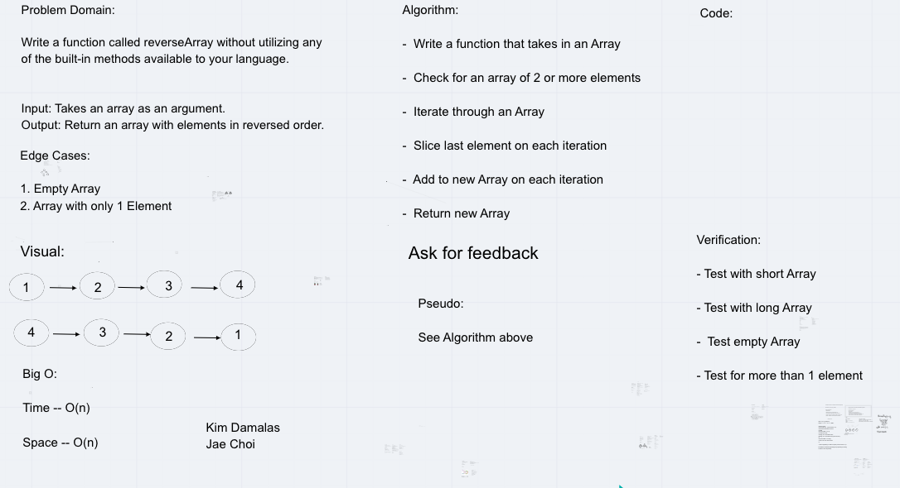

# Reverse an Array
This is code challenge 01 of 401-Python (seattle-py-401n2)

Developers: Kim Damalas and Jae Choi

Date: 7 December 2020
____________________
## Challenge

Write a function called reverseArray which takes an array as an argument. Without utilizing any of the built-in methods available to your language, return an array with elements in reversed order.
__________

## Approach & Efficiency

We chose to use a function called reverseArray that implemented a list slicing approach which has a linear efficiency of O(N).

___________

## Solution

First we checked for edge cases of an empty array or a one element array with `if statements` 

We looped through the array and on each iteration:

- sliced off the last element of the list using default beginning and end and a step of -1 
`list[::-1]`

- stored the sliced value in the new array we created

When we finished the last iteration, we returned the new array

Our whiteboarding session, using Remo's built-in whiteboard:

