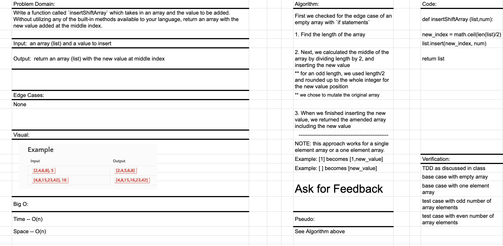

# Shift an Array
This is code challenge 01 of 401-Python (seattle-py-401n2)

Developers: Kim Damalas with Nick Dorkins  

Date: 10 December 2020
____________________
## Challenge

Write a function called `insertShiftArray` which takes in an array and the value to be added. Without utilizing any of the built-in methods available to your language, return an array with the new value added at the middle index.
__________

## Approach & Efficiency

We chose to use a function called `insertShiftArray` that determines the length of the array, determines the middle index, and inserts the new value at array(middle+1).

This function has O(n) time and space efficiency.

___________

## Solution

1. Find the length of the array

2. Next, we calculated the middle of the array by dividing length by 2, and inserting the new value 

- for an odd length, we used length/2 and rounded up to the whole integer for the new value position

- we chose to mutate the original array

3. When we finished inserting the new value, we returned the amended array including the new value

xxxxxxxxxxxxxx

NOTE: this approach works for a single element array or a one element array.

Example: [1] becomes [1,new_value]

Example: [ ] becomes [new_value]
_____________
## Testing

We used unit tests as discussed in class to iterate our software build in small steps.  The tests are found in the [Test Code File](./test_array_shift.py)

- base case with empty array
- base case with one element array
- test case with odd number of array elements
- test case with even number of array elements
_______________

## Contributing

Partner: Nick Dorkins

Our whiteboarding session:

