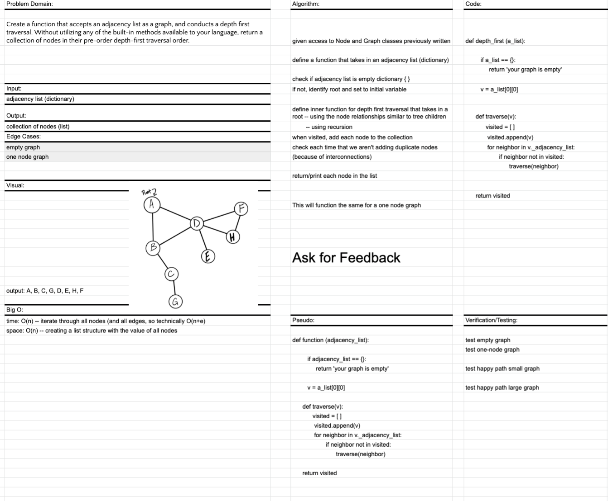

# Depth First for Graphs

## PR for this file: https://github.com/kimmyd70/data-structures-and-algorithms/pull/73

This is code challenge 38 of 401-Python (seattle-py-401n2)

Developers: Kim Damalas

Date: 5 April 2021
____________________
### Challenge 

Create a function that accepts an adjacency list as a graph, 
and conducts a depth first traversal. Without utilizing any of the built-in methods available to your language, return a collection of nodes in their pre-order depth-first traversal order.
__________

## Approach & Efficiency

Approach is laid out on **Whiteboard** below

Time: O(n) -- traverse the entire adjacency list

Space: O(n) -- create storage list with n items

_____________
## Required Testing - Unit test for

1. Happy Path: small and large graphs return proper collection
   
2. Empty Graph: return error 

_________________

## Whiteboard

