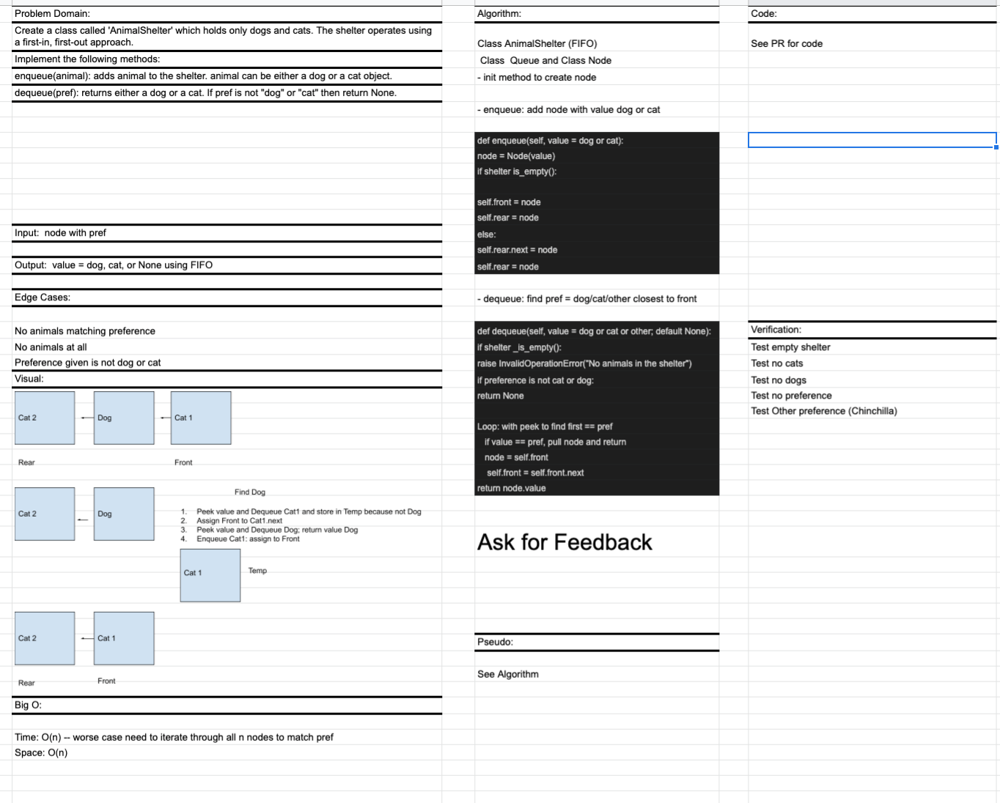

# FIFO Animal Shelter

## PR for this file: https://github.com/kimmyd70/data-structures-and-algorithms/pull/56

This is code challenge 12 of 401-Python (seattle-py-401n2)

Developers: Kim Damalas

Date: 13 January 2021
____________________
### Challenge 

1. Create a class called `AnimalShelter` which holds only dogs and cats. The shelter operates using a first-in, first-out approach.

2. Implement the following methods:

- enqueue(animal): adds animal to the shelter. animal can be either a dog or a cat object.

- dequeue(pref): returns either a dog or a cat. If pref is not "dog" or "cat" then return null.

__________

## Approach & Efficiency

Approach is using classes and their methods to instantiate and manipulate our stacks and queues.  

Time: O(n) -- worst case assumes  we must traverse the entire list to find preference given

Space: O(1) -- adding or removing from stack or queue, peek, and is_empty method; will need Temp node, but believe that's still O(n)

_____________
## Required Testing

1. Test empty shelter
2. Test no cats
3. Test no dogs
4. Test no preference
5. Test Other preference (Chinchilla)

_________________

