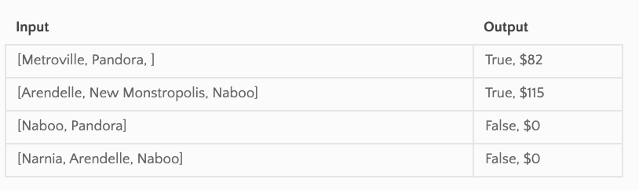

# Graph: get_edges

Developer: Kim Damalas

## PR for this file: https://github.com/kimmyd70/data-structures-and-algorithms/pull/69

This is code challenge 36 of 401-Python (seattle-py-401n2)

Date: 31 March 2021
____________________
### Challenge 

Write a function based on the specifications above, which takes in a graph, and an array of city names. Without utilizing any of the built-in methods available to your language, return whether the full trip is possible with direct flights, and how much it would cost.

____________

## Approach & Efficiency

Approach is using Nodes, Classes

Time:   O(n) -- traverse the entire graph 

Space:  O(1) -- store and return 2 variables

_____________
## Required Testing

Test 3 edge cases:
empty graph
one node graph
no round trips at all

Also test 2-city list pass, 3-city list pass, 2 city-list fail, 3-city list fail
_________________

## Whiteboard

CC#36 

Coded using this city graph and example list 

