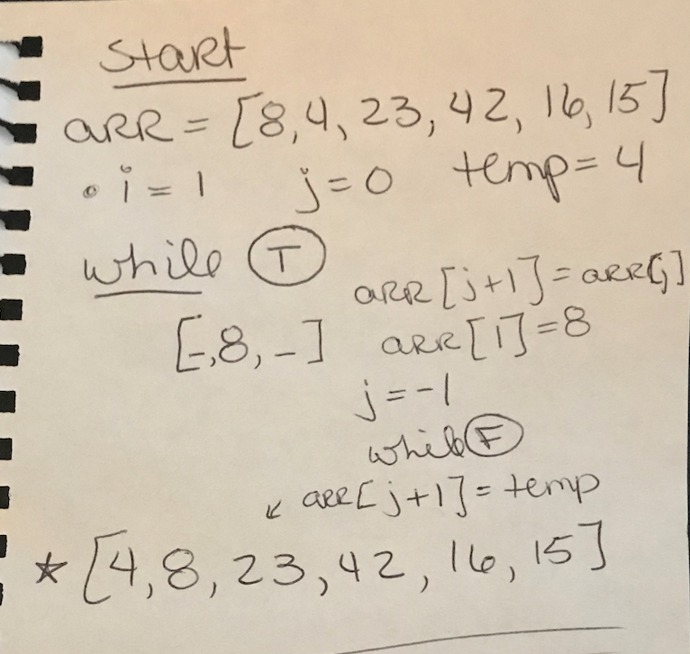
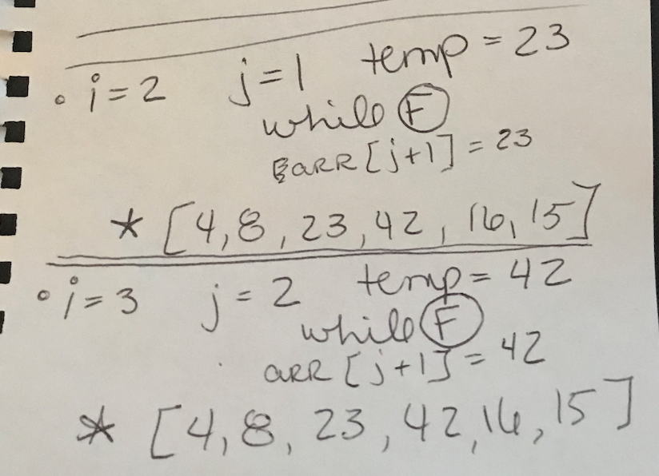

# Insertion Sort
Code Challenge 26

 PR located at: https://github.com/kimmyd70/data-structures-and-algorithms/pull/62

 _______________

Given the pseudocode below, we'll trace the algorithm given 

using the Sample Array
`[8,4,23,42,16,15]`
___________________

Pass 1: For loop with i = 1

In the first pass through, we compare the first two elements in the array and swap them: `[4,8,23,42,16,15]`

____________

___________________

Pass 2: For loop with i = 2

Pass 3: For loop with i = 3

In passes 2-3, we use the same comparison method as in the first pass, but comparing the 3rd and the 4th element.  Because the `while` loop is false in both cases, these two passes have the affect of leaving the 3rd and 4th elements in their original places: `[4,8,23,42,16,15]`

____________

___________________

Pass 4: For loop with i = 4

Pass 4 is a longer process because we go through the `while` loop twice comparing the 5th element to the new 4th and 3rd and moving the insertion one spot closer to the front with each comparison: `[4,8,16,23,42,15]`

____________

___________________

Pass 5: For loop with i = 5

The final iteration compares the last element in the array with all those previously sorted.  This pass goes through the `while` loop and compares 3 times, moving the insertion one spot closer to the front with each comparison and returning the fully sorted array: `[4,8,15,16,23,42]`

____________

______________
### Efficiency
Time: O(n^2)--
The basic operation of this algorithm is comparison. This will happen n * (n-1) number of times…concluding the algorithm to be n squared.

Space: O(1)--
No additional space is being created. This array is being sorted in place…keeping the space at constant O(1).