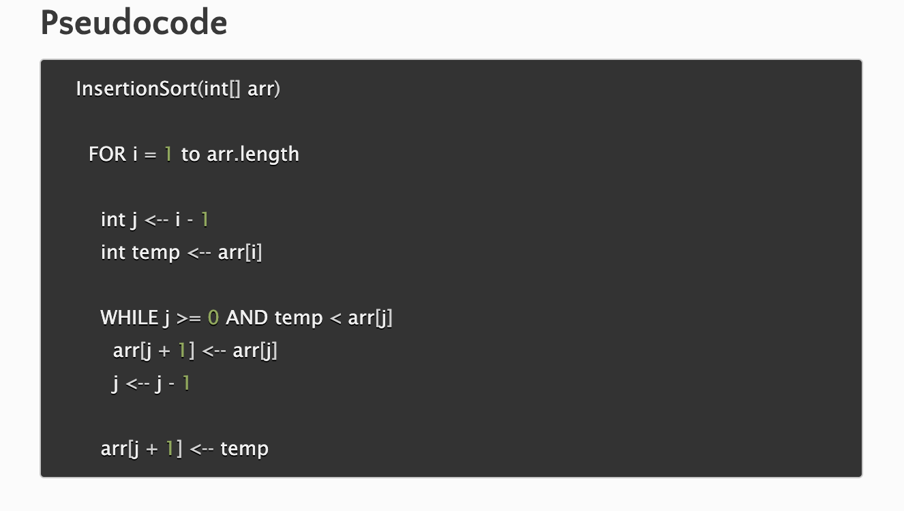

## Insertion Sort
Code Challenge 26

PR located at: https://github.com/kimmyd70/data-structures-and-algorithms/pull/62

Given the pseudocode below, we'll trace the algorithm given 

using the Sample Array
`[8,4,23,42,16,15]`
___________________

Pass 1:

____________

___________________

Pass 2:

____________

______________
### Efficiency
Time: O(n^2)--
The basic operation of this algorithm is comparison. This will happen n * (n-1) number of times…concluding the algorithm to be n squared.

Space: O(1)--
No additional space is being created. This array is being sorted in place…keeping the space at constant O(1).