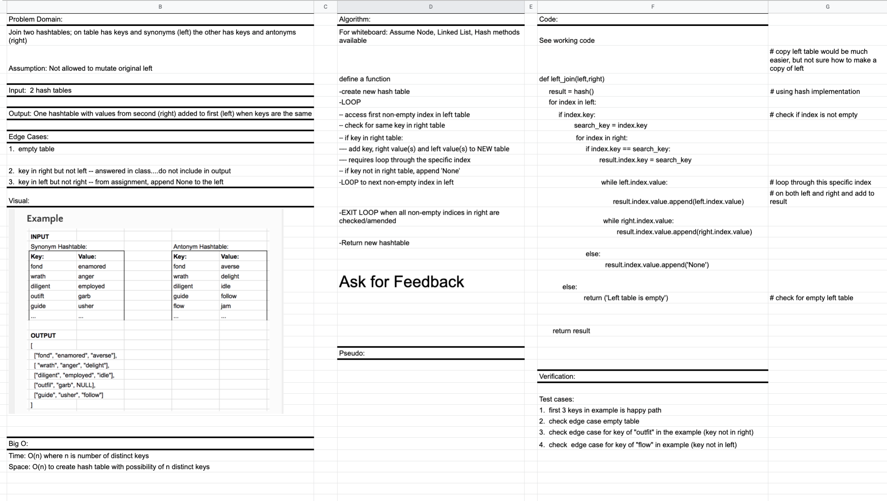

# Left Join

Developer: Kim Damalas

## PR for this file: https://github.com/kimmyd70/data-structures-and-algorithms/pull/67

This is code challenge 33 of 401-Python (seattle-py-401n2)

Date: 22 March 2021
____________________
### Challenge 

1. Write a function that LEFT JOINs two hashmaps into a single data structure.

2. The first parameter is a hashmap that has word strings as keys, and a synonym of the key as values.

3. The second parameter is a hashmap that has word strings as keys, and antonyms of the key as values.

4. Combine the key and corresponding values (if they exist) into a new data structure according to LEFT JOIN logic.

5. LEFT JOIN means all the values in the first hashmap are returned, and if values exist in the “right” hashmap, they are appended to the result row. If no values exist in the right hashmap, then some flavor of NULL should be appended to the result row.

6. The returned data structure that holds the results is up to you. It doesn’t need to exactly match the output below, so long as it achieves the LEFT JOIN logic.

7. Avoid utilizing any of the library methods available to your language.

____________

## Approach & Efficiency

Approach is using Hash Table methods and comparisons

Time:   O(n) -- traverse the n number of keys

Space:  O(n) -- building a return hashtable with as many as n indices and multiple values in each

_____________
## Required Testing

No tests required from CC#32 assignment, but write unit test to capture:
1. happy path
2. known failure
3. edge cases (empty tree, one node tree, 3 node tree all same value, negative numbers present; float values will behave the same as int because of python operator defaults)
_________________

## Whiteboard

CC#33--Coming Soon!

