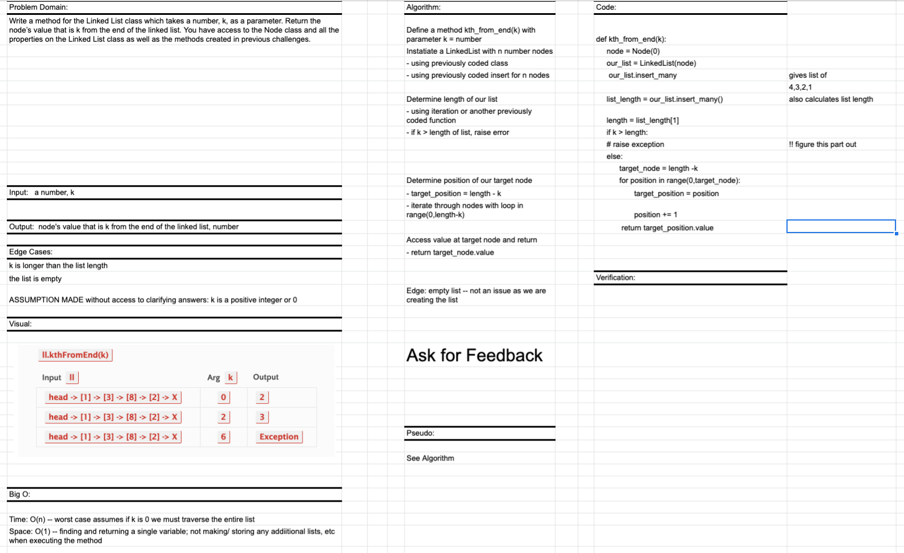

# Singly Linked List--extended for insertions and kth element value

## PR for this file: https://github.com/kimmyd70/data-structures-and-algorithms/pull/51
This is code challenge 07 of 401-Python (seattle-py-401n2)

Developers: Kim Damalas

Date: 23 December 2020
____________________
## Challenge

Use Node class and some testing from Code Challenge 05.

Extend your LinkedList class by a method called `kth_from_end()`:

- Write a method for the `LinkedList` class which takes a number, `k`, as a parameter. Return the node’s value that is k from the end of the linked list. 

- You have access to the Node class and all the properties on the Linked List class as well as the methods created in previous challenges.

__________

## Approach & Efficiency

Approach is using classes and their methods to instantiate, traverse, and manipulate our linked list.  It also makes use of previously coded methods in this project.

Time: O(n) -- worst case assumes if k is 0, we must traverse the entire list

Space: O(1) -- finding and returning a single variable; not making/storing any addiitional lists, etc when executing the method

NOTE:  

>ASSUMPTION MADE in whiteboarding without access to clarifying answers: k is a positive integer or 0 

>BUT, I see testing requires a test of a negative k, so whiteboarding session algorithm will need to be amended 

_____________
## Required Testing

1. Where k is greater than the length of the linked list
(raise error)

2. Where k and the length of the list are the same
(return value of head)

3. Where k is not a positive integer
(raise error or use absolute value of k ??)

4. Where the linked list is of a size 1
(k can only be 1 or raise error)

5. “Happy Path” where k is not at the end, but somewhere in the middle of the linked list
(any k < list length)

_________________

