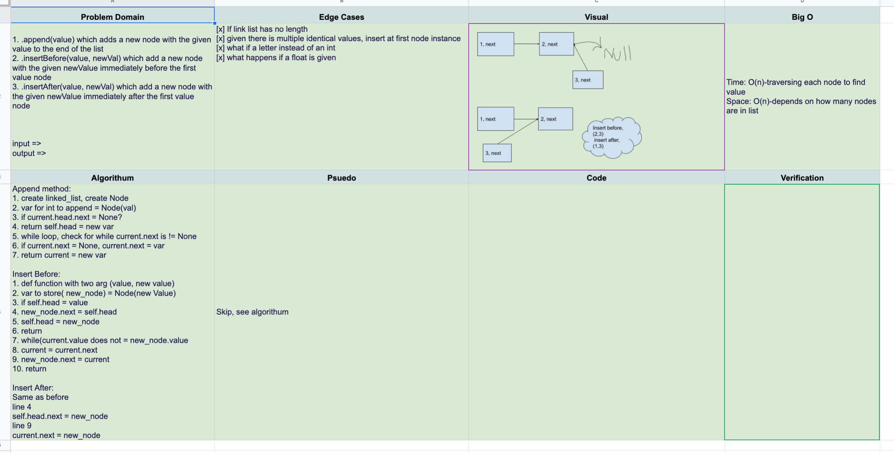

# Singly Linked List--extended for insertions

## PR for this file: https://github.com/kimmyd70/data-structures-and-algorithms/pull/49
This is code challenge 06 of 401-Python (seattle-py-401n2)

Developers: Kim Damalas, Amber Falbo, Anthony Beaver, Audrena Vacirca, Robert Carter

Date: 22 December 2020
____________________
## Challenge

Use Node class and some testing from Code Challenge 05.

Extend your LinkedList class with:

1. `.append(value)` which adds a new node with the given `value` to the end of the list.

2. `.insertBefore(value, newVal)` which add a new node with the given `newValue` immediately before the first `value` node

3. `.insertAfter(value, newVal)` which add a new node with the given `newValue` immediately after the first `value` node

__________

## Approach & Efficiency

Approach is using classes and their methods to instantiate, traverse, and manipulate our linked list

This function has O(n) time and space efficiency except for adding a node at the head which is O(1)

_____________
## Required Testing

1. Can successfully add a node to the end of the linked list

2. Can successfully add multiple nodes to the end of a linked list

3. Can successfully insert a node before a node located i the middle of a linked list

4. Can successfully insert a node before the first node of a linked list

5. Can successfully insert after a node in the middle of the linked list

6. Can successfully insert a node after the last node of the linked list

_________________

