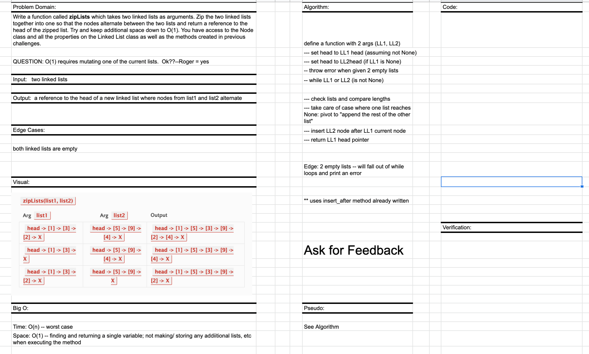

# Singly Linked List

## PR for this file:
https://github.com/kimmyd70/data-structures-and-algorithms/pull/53

This is code challenge 08 of 401-Python (seattle-py-401n2)

Developers: Kim Damalas 
- with Sian Culligan looking over my whiteboard I did before class since she had already turned in this assignment  

Date: 19 December 2020
____________________
## Challenge

1. Write a function called `zipLists` which takes two linked lists as arguments. Zip the two linked lists together into one so that the nodes alternate between the two lists and return a reference to the head of the zipped list. Try and keep additional space down to O(1). You have access to the Node class and all the properties on the Linked List class as well as the methods created in previous challenges.

NOTE: I copied in previously-coded Node class that has properties for the value stored in the Node, and a pointer to the next Node.

NOTE: I copied in previously-coded LinkedList class, include a head property. Upon instantiation, an empty Linked List should be created.

NOTE: I copied in previously-coded insert_after method for use

This function has O(n) time and O(1) space iterating through given link lists and mutating one of the lists

_____________
## Required Testing

1. Can successfully instantiate an empty linked list

2. Can handle List1 with more elements than List2

3. Can handle List2 with more elements than List1

4. Can properly insert multiple nodes and mutate one of the given linked lists

5. Will return the correct head reference of the final list

6. Will return the new mutated list

_________________

Whiteboard 