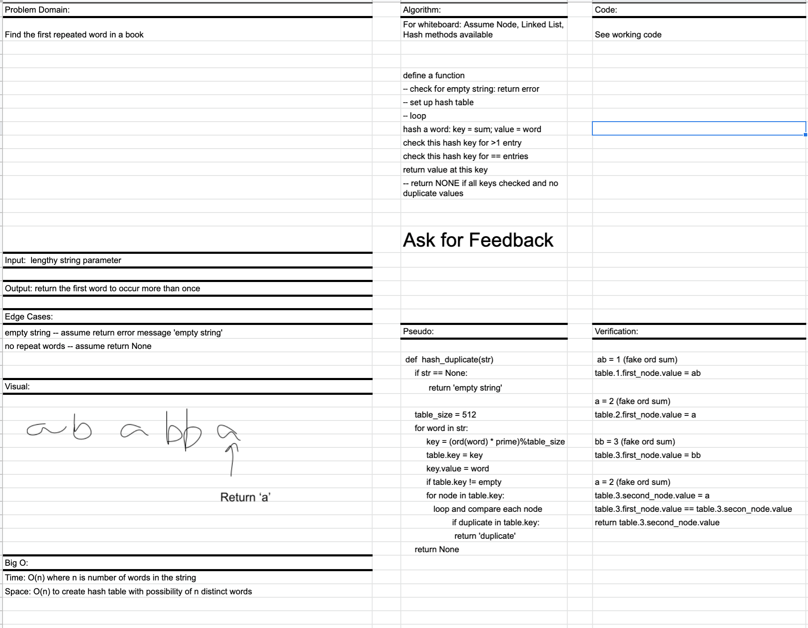

# Repeated Word (using hash table)

## PR for this file: https://github.com/kimmyd70/data-structures-and-algorithms/pull/65

This is code challenge 30 of 401-Python (seattle-py-401n2)

Developers: Kim Damalas

Date: 15 March 2021
____________________
### Challenge 

1. Find the first repeated word in a book.
    - Write a function that accepts a lengthy string parameter.

    - Without utilizing any of the built-in library methods available to your language, return the first word to occur more than once in that provided string.
__________

## Approach & Efficiency

Approach is using a hash table, comparison `if` statements and looping as laid out on **Whiteboard** below

Time: O(n) -- traverse the entire string, hash, compare

Space: O(n) -- hash table with n number of indices

_____________
## Required Testing

At least 3 assertions for each function
_________________

